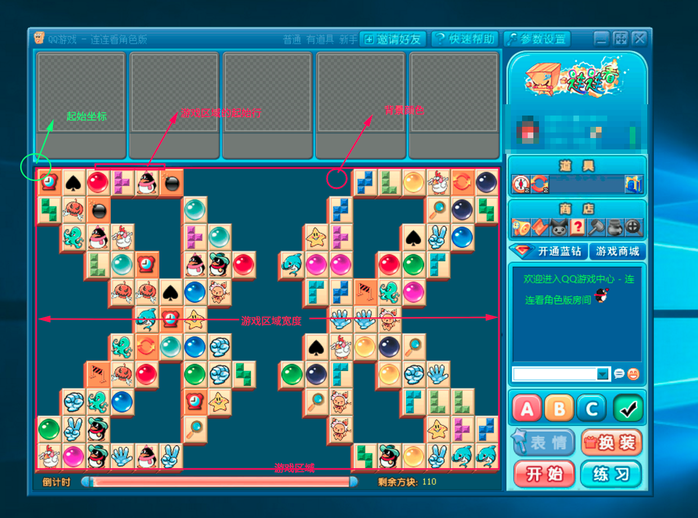
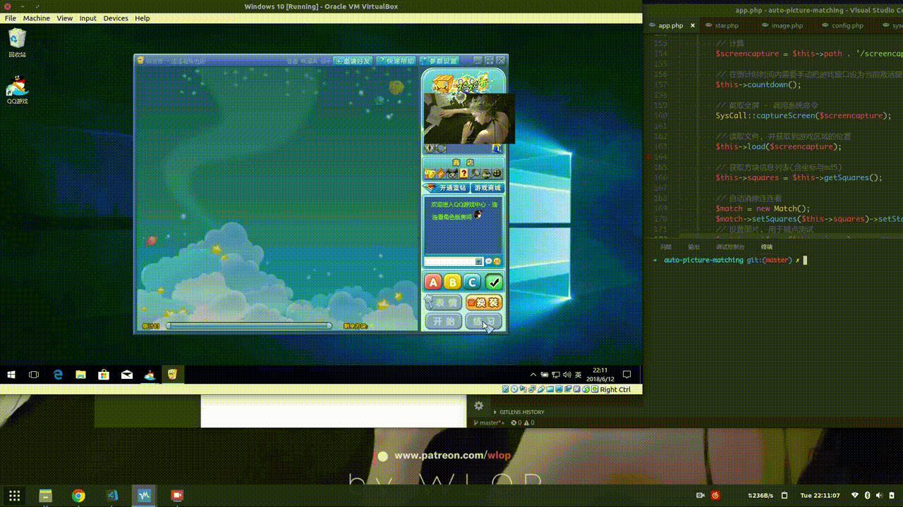

# 连连看外挂

### 本项目仅供学习交流使用, 不得用于商业用途, 大肆流传会造成其他公司的损失, 请自觉遵守法律法规和道德规范.

### 说明

* 环境: 基于 PHP 的 GD 库.

* 配置: 详见[config.php](src/config.php).

* **注意1:** 为了避免不必要的影响, 当前项目配置是第三方的连连看(使用**三级狗**的[TheThreeDog/Auto-Lianliankan](https://github.com/TheThreeDog/Auto-Lianliankan)中提供的连连看), [游戏下载地址](https://github.com/TheThreeDog/Auto-Lianliankan/raw/master/%E8%BF%9E%E8%BF%9E%E7%9C%8B.rar). **不提供QQ连连看配置**, 如需要请自行配置.

* **注意2:** PHP 是没有自带的扩展支持**截屏**和**模拟鼠标单击**动作的, 因此需要外部系统命令支持, 调用修改位置[syscall.php](src/syscall.php), 自行替换成自己系统的外部命令. 其中, 默认调用的是我用go写的一个截图和模拟鼠标单击的程序(源码[control.go](src/control.go), **只编译了Linux版本**), 使用了[go-vgo/robotgo](https://github.com/go-vgo/robotgo)(支持全平台), 如要使用这个请自行根据[go-vgo/robotgo](https://github.com/go-vgo/robotgo)的文档安装环境再编译.(其实可以直接用go撸一个, 逃

* **本项目只在Linux(Xorg)环境下测试通过装在Win10虚拟机中的连连看. (逃...**

### 思路

* 截取全屏(调用外部系统命令).

* 假设背景颜色为**BG**.

* 扫描每行像素颜色(你的桌面不能连续游戏区域宽度与背景颜色**BG**一样, 不能混淆), 满足连续**BG**颜色的**游戏区域长度**的行首标记为起始坐标, 适当调整到第一个方块的左上角坐标, 之后截取整个游戏区域(不含方块的侧边).

  

* 按方块大小截取并按 **\(x\)\(y\)坐标** => **图片数据**的键值方式保存所有方块列表. 其中通过判断方块中间横线(横坐标)像素颜色是不是连续满足一定长度与背景颜色**BG**一致来过滤掉空的方块, 将这些空方块的**图片数据**设为**空**.

* 遍历方块列表判断是否连通, 是的话**模拟鼠标点击**, 将相连的2个坐标\(x\)\(y\)对应的图片数据设为空.

* 重复上一步, 直至全部完成.

### 为什么做这个

在知乎上看到**ID:三级狗**的[你看过／写过哪些有意思的代码？](https://www.zhihu.com/question/275611095/answer/407984155)的回答, 就想能不能用php也撸一个, 因此就有了这个项目, [我的回答](https://www.zhihu.com/question/275611095/answer/416208184).

### 演示

